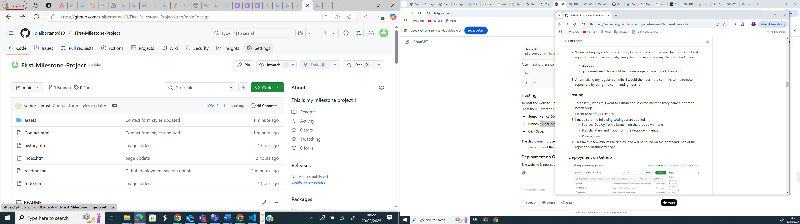
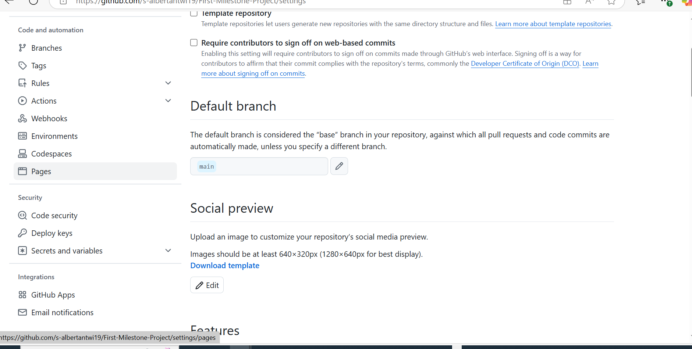
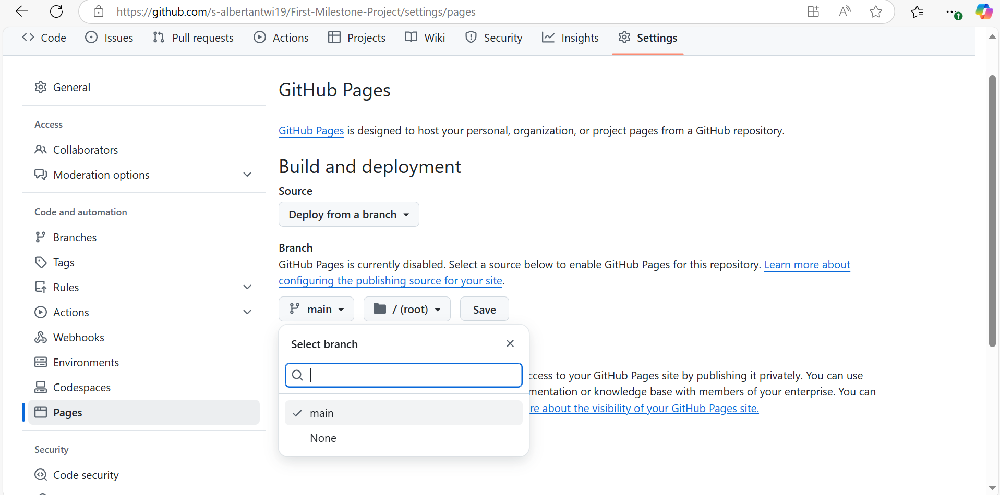
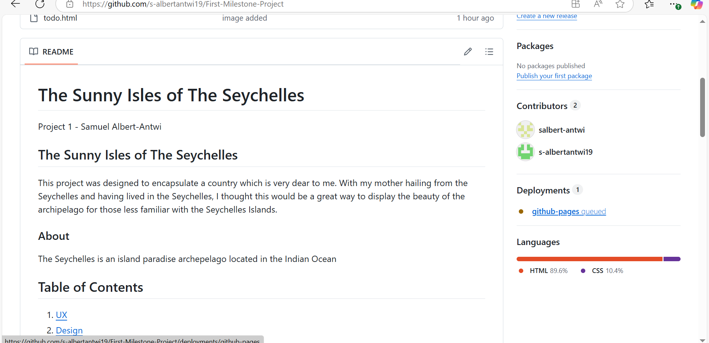
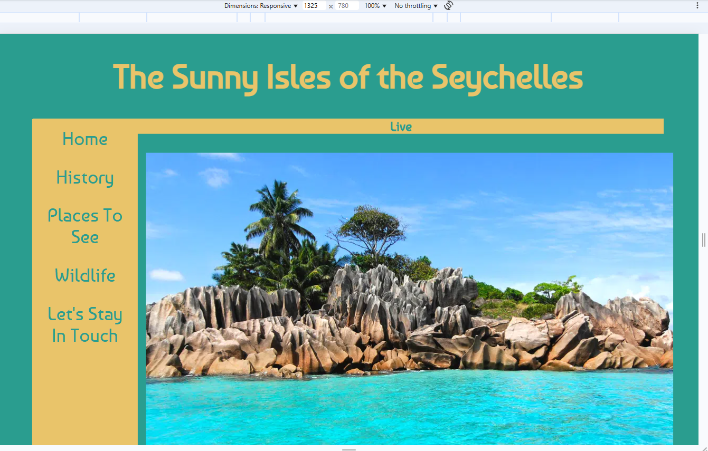
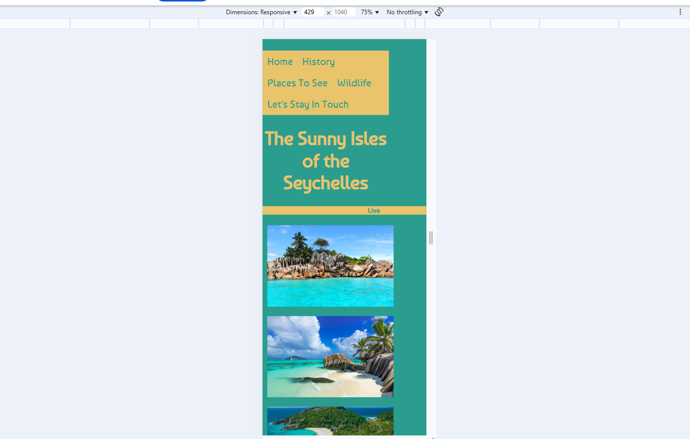
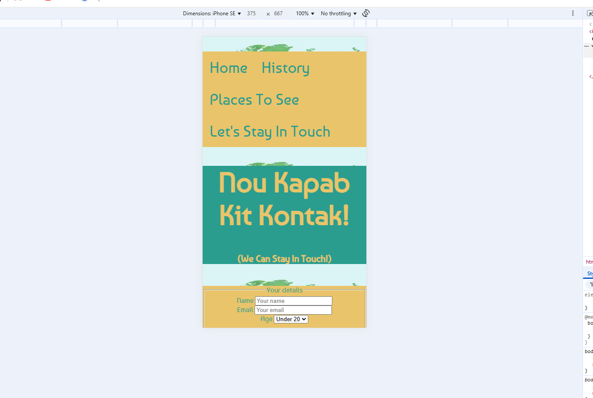
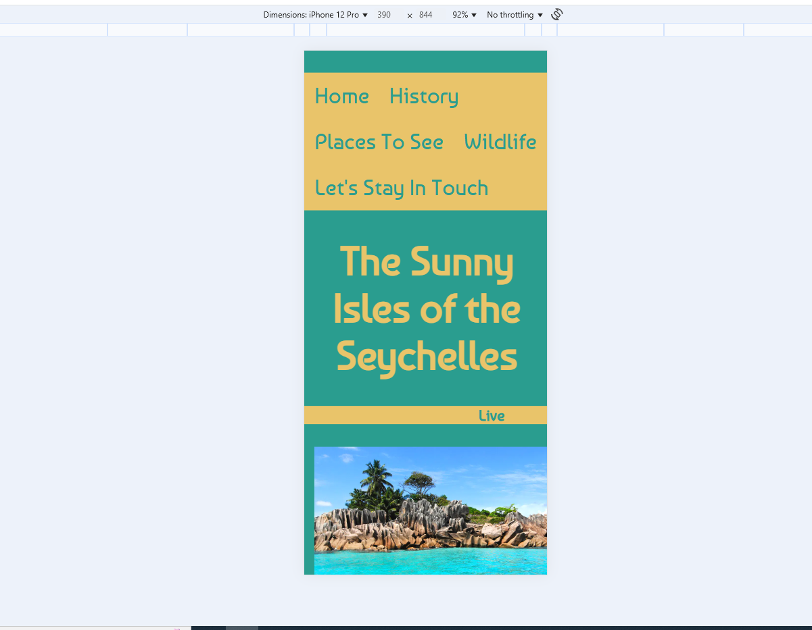
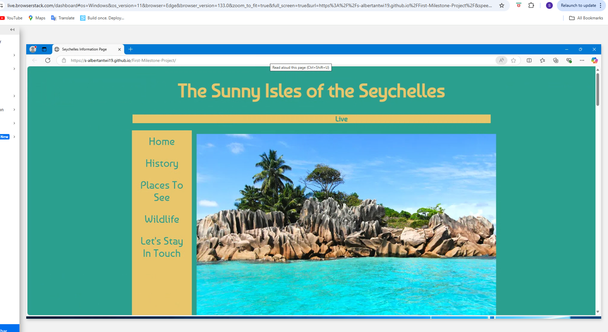

# The Sunny Isles of The Seychelles

[Project 1](https://s-albertantwi19.github.io/First-Milestone-Project/) - Samuel Albert-Antwi 

## The Sunny Isles of The Seychelles

This project was designed to encapsulate a country which is very dear to me. With my mother hailing from the Seychelles and having lived in the Seychelles, I thought this would be a great way to display the beauty of the archipelago for those less familiar with the Seychelles Islands.

### About 

The Seychelles is an island paradise archepelago located in the Indian Ocean

## Table of Contents
1. [UX](/#user)
2. [Design](/#design)
3. [Deployment](/#deployment)
4. [Features](/#features)
5. [Testing](/#testing)
6. [Technologies Used](/#technologies)
7. [Credits and References](/#credits)

# User Experience UX
## User Stories

The aim of the Seychelles Information page was to shine light on a lesser known island paradise with a humble population of < 100,000 people. With images of the island paradise on each page, the user should feel emerged in sunshine and therefore inclined to explore the archepelago nation further.

The primary focus of the site is to give a taste of the rich culture of the Seychelles. 

# Design

The website has been created across 4 pages - the initial page being a responsive photo gallery displaying the beaches, the mountainous regions and then the urban landscape.

The chosen colour scheme has been selected to reflect a warm, tropical feeling.

# Deployment

To deploy the project I have utilised Github Desktop and Github

## My Repository

I created a new Github repository and cloned the repository using Github Desktop to develop locally in Visual Studio Code.

Whilst coding in Visual Studio Code, I ensured to save my development at each interval and regularly commit to the respository with commit messages on Github Desktop - this was the preferred method of developing as my Github account had failures when linking to Visual Studio Code. Had this not been an issue, I would have utilised the terminal to make my git commit statements and git push commands.

## Hosting

In order to host the website, I navigated to Github and selected my public repository named 'First-Milestone-Project' and proceeded as below:

- Settings > Pages
- Source: Select 'Deploy from a branch' from the dropdown menu
- Branch: Select 'Main' and 'root' from the dropdown menus
- Save

The website is now successfully deployed on GitHub Pages once you revert to your repository (initially it will say queued)

# Features

The feautures for the webpage were chosen for easy accessibility and a simple user experience.

## Navigation

For the webiste I opted for a sidebar navigation menu, which remains across each page. In order to do so, the main page has a margin to allow space for this navbar. For smaller screens, the navbar goes to the top of the page

## Full Screen (Desktop) View

## Smaller Screen View

## IPhone SE View

## IPhone 12 Pro View

# Testing

In order to test, I used different web browsers in using [Browser Stack](https://www.browserstack.com/)

### Broswer Stack Testing

# Technologies Used

## Languages

HTML and CSS have been used in the development of the website

## Technology

Github and Github Desktop have been used to deploy and commit changes respectively

# Credits and References

Throughout the development of the website I used the following references:

- Code Institute example code from HTML and CSS Essentials
- [GeeksForGeeks](https://www.geeksforgeeks.org/)
- [W3Schools](W3Schools.com)
- [How to make a responsive site for all devices](https://www.youtube.com/watch?v=ZYV6dYtz4HA) for responsive design on all devices

# Author
Samuel Albert-Antwi

