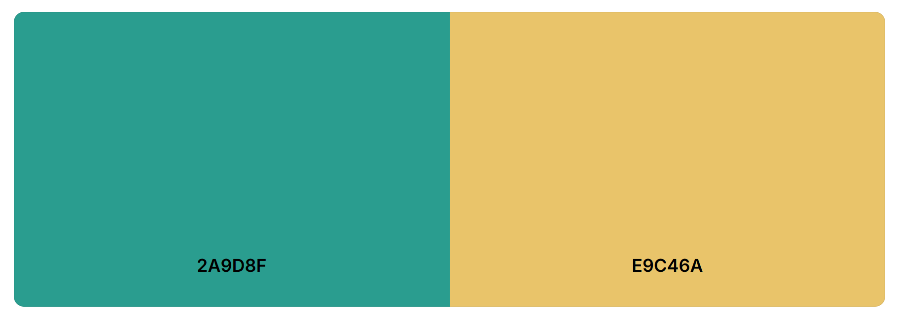

# The Sunny Isles of The Seychelles

Project 1 - Samuel Albert-Antwi

## The Sunny Isles of The Seychelles

This project was designed to encapsulate a country which is very dear to me. With my mother hailing from the Seychelles and having lived in the Seychelles, I thought this would be a great way to display the beauty of the archipelago for those less familiar with the Seychelles Islands.

### About 

The Seychelles is an island paradise archepelago located in the Indian Ocean

## Table of Contents
1. [UX](/#userexperience)
2. [Design](/#design)
3. Deployment
4. Features
5. Testing
6. Technologies Used
7. Credits and References

# User Experience UX

# Design

# Deployment

